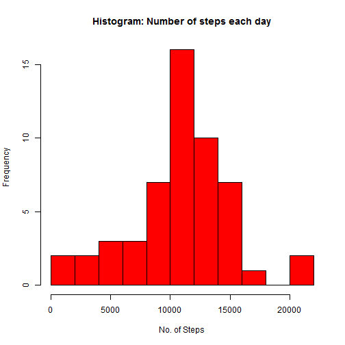
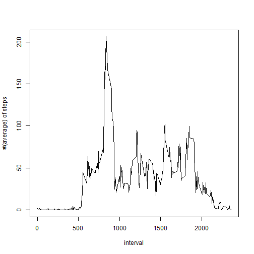
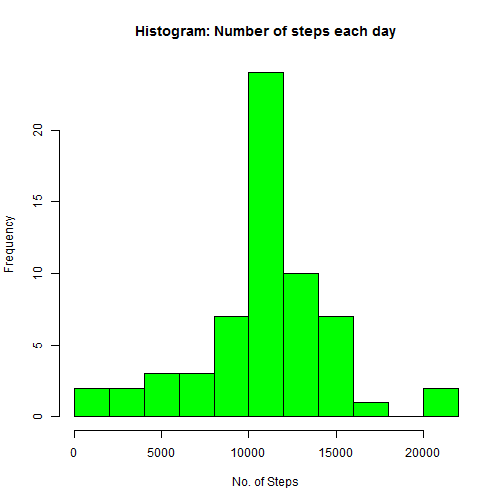
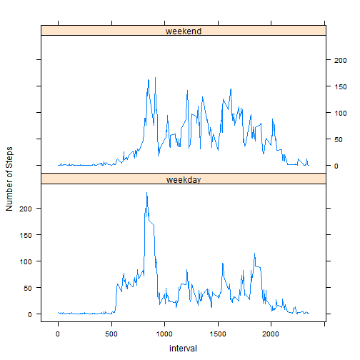

## Loading and preprocessing the data
We load the data from the comma separated file named "acitivity" in the activity.zip folder.


```r
## Importing the data from the zipped file and saving dates as class Date
data <- read.csv(unz("activity.zip", "activity.csv"), header = TRUE)
data$date <- as.Date(data$date)
```


## What is mean total number of steps taken per day?
Here we plot a histogram for the total number of steps per day and then get a mean number of steps per day and the median for the number of steps per day. For this section we can ignore the missing values.


```r
## First we remove the missing data sets from data
data_wNA <- data[complete.cases(data), ]

## Now we split the data based on the data and calculate the sums for each factor
library(plyr)
daily_steps <- ddply(data_wNA,.(date), summarize, sum = sum(steps))
daily_steps$date <- as.Date( daily_steps$date, '%Y-%m-%Y')
hist(daily_steps$sum, col = "red", main = "Histogram: Number of steps each day",
     xlab = "No. of Steps", breaks = 10)
```

 

```r
cat("The mean value for the number of steps each day is ",
    mean(daily_steps$sum),".")
```

```
## The mean value for the number of steps each day is  10766.19 .
```

```r
cat("The median value for the number of steps each day is ", 
    median(daily_steps$sum),".")
```

```
## The median value for the number of steps each day is  10765 .
```


## What is the average daily activity pattern?
In this question, we look at the activity of the five minute periods each day and 
calculate the average for that period. For this section as well, I will be using the
data that excludes the NA values.


```r
int_steps <- ddply(data_wNA,.(interval), summarize, mean = mean(steps))
plot(int_steps$interval, int_steps$mean, xlab = "interval",
     ylab = "#(average) of steps", type = "l")
```

 

```r
cat("The interval which has the highest average number of steps is ",
    match(max(int_steps$mean), int_steps$mean),"th observation: ",
    int_steps$interval[match(max(int_steps$mean), int_steps$mean)])
```

```
## The interval which has the highest average number of steps is  104 th observation:  835
```


## Imputing missing values
In order to fill the missing values, I plan to use the average value of that
particular interval. To do this, I am gonna run a loop, check the interval
and use that to look up integeral number of average steps.


```r
## Here we will use the complete dataset
## First we find out the number of NA values

cat("The total number of missing values in the dataset is: ",
    sum(is.na(data$steps)))
```

```
## The total number of missing values in the dataset is:  2304
```

```r
## Now we substitute the missing values with the average for that interval

new_data <- data
for(i in 1:nrow(new_data)){
        if(is.na(new_data$steps[i]) == TRUE){
                new_data$steps[i] <- floor(int_steps$mean[match(new_data$interval[i],
                                                      int_steps$interval)])
        }
}
```

A histogram for the average number of steps each day with missing values filled 
in.


```r
n_daily_steps <- ddply(new_data,.(date), summarize, sum = sum(steps))
n_daily_steps$date <- as.Date(n_daily_steps$date, '%Y-%m-%Y')
hist(n_daily_steps$sum, col = "green", main = "Histogram: Number of steps each day",
     xlab = "No. of Steps", breaks = 10)
```

 

```r
cat("The mean value for the number of steps each day is ",
    mean(n_daily_steps$sum),".")
```

```
## The mean value for the number of steps each day is  10749.77 .
```

```r
cat("The median value for the number of steps each day is ", 
    median(n_daily_steps$sum),".")
```

```
## The median value for the number of steps each day is  10641 .
```

There is a minor impact of filling in the missing values. The mean for the
number of steps has reduced from 10766 to 10749.77 whereas the median has
changed from 10765 to 10641. one of the main reasons for the fall in the mean
value may be that I have used the ceiling value of the average for filling in
the missing values

## Are there differences in activity patterns between weekdays and weekends?


```r
weekday <- c("Mon", "Tue", "Wed", "Thu", "Fri")
weekend <- c("Sat", "Sun")

## Here we split our entire dataset into factor weekday and weekend

for(i in 1:nrow(new_data)){
        if(weekdays(new_data$date[i], abbreviate = TRUE) %in% weekday){
                new_data$day[i] <- "weekday"}
        else if(weekdays(new_data$date[i], abbreviate = TRUE) %in% weekend){
                new_data$day[i] <- "weekend"}
}

new_data_day <- new_data[new_data$day == "weekday", ]
new_data_end <- new_data[new_data$day == "weekend", ]
int_steps_day <- ddply(new_data_day,.(interval), summarize, mean = mean(steps))
int_steps_end <- ddply(new_data_end,.(interval), summarize, mean = mean(steps))
int_steps_day$day <- rep("weekday", nrow(int_steps_day))
int_steps_end$day <- rep("weekend", nrow(int_steps_end))
all_days <- rbind(int_steps_day, int_steps_end)

library(lattice)

## Plotting the panel plot

all_days <- transform(all_days, day = factor(day))
xyplot(mean ~ interval|day, data = all_days, layout = c(1,2), type = 'l',
       xlab = "interval", ylab = "Number of Steps")
```

 
